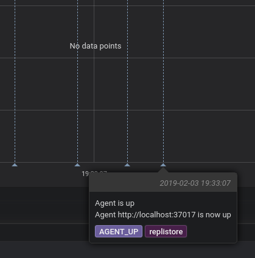
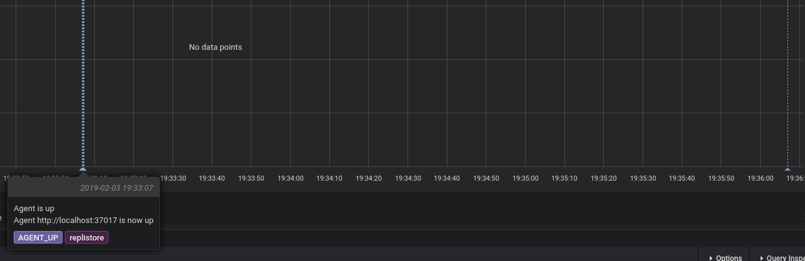
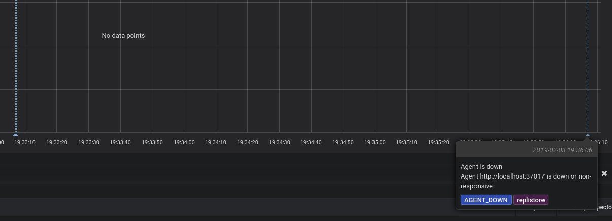

Before you can react to a change in the system you need to know that something has changed.

Replicante first task is to observe all nodes and generate events to reflect changes to nodes and clusters.
These events are internally used to drive features but are also recoded for the user to see.

Having access to historical events can provide valuable insight.
Increase error rates? Is/was the datastore down or in the middle of a failover?
Being able to correlate datastore events with application errors, performance issues,
or other unusual activity is key into improving your own code.

## WebUI history view
The simplest way to view the events history is to check out the `Events` page in the [WebUI](features-webui.md).

## Stream subscription
Observed and generated events are emitted onto a stream.

Events order is guaranteed for events in the same cluster but events from different clusters
can be interleaved in any order.
System events order is also guaranteed with respect to other system events but not to cluster events.

<blockquote class="warning">

Events are currently emitted to the primary store (MongoDB) and will be moved to
a streaming platform (Kafka) shortly.

Most features related to events streaming will not be available until then.

</blockquote>

The stream of events acts as the source of state information for most of the system
and drives the actions subsystem.
Both causes and effects of system state changes will be reflected in this stream.

On top of being a foundation for Replicante itself, the use of an event stream means that
external systems can be designed to follow (or subscribe to) the stream to be notified
of events as they occur.

Such powerful extension point opens the system up for almost endless integrations.
To name just a few:

  * Send notifications when events occur.
  * Trigger custom automated actions and verify their results.
  * Collect context useful for possible Root Cause Analysis or other reporting.
  * And much much more ...

### Snapshot events
Replicante periodically emits a special kind of event to describe the current state of an item.

Since Replicante monitors distributed systems it is not possible to consistently provide a
point in time view of monitored clusters.
It is on the other hand possible to observe individual parts of the cluster state consistently.

These `SNAPSHOT_*` events each describe a different part of the system at a different point in time.
External systems can make use of these snapshot events to synchronise their state with the observed
state of the cluster and compensate for missing events or other errors.

Event snapshots can be disabled by setting the `events.snapshots.enabled` option to `false`.
This feature is enabled by default.

<blockquote class="warning">

The `events.snapshots.frequency` configuration options controls how often snapshots should be emitted.

The system does not currently guarantee an upper bound to the time between intervals.

</blockquote>

## Grafana annotations
Building on the events stream mentioned above, Replicante core offers [Grafana](https://grafana.com/)
[annotations](http://docs.grafana.org/reference/annotations/) integration!

This feature required the Grafana component to be enabled enabled (`components.grafana` config option; enabled by default).

A set of endpoints compatible with the
[simple JSON datasource](https://grafana.com/plugins/grafana-simple-json-datasource)
is available under the `/api/v1/grafana` root.

### Grafana configuration
The annotations integration mainly provide a specialised query interface to the events list
so most of the configuration is on the Grafana side:

  1. Install the [simple JSON datasource](https://grafana.com/plugins/grafana-simple-json-datasource)
     plugin if not already installed.
  2. Configure a new `simple JSON` datasource point to `http://REPLICANTE_HOST:REPLICANTE_PORT/api/v1/grafana`
     if not already available.
  3. On a dashboard, configure a new annotation query using the newly created datesource.
  4. (Optional) Filter events by adding JSON encoded filters as the query text.

### Annotation filters
By default, the first 1000 non-`SNAPSHOT_*` events in the queried interval are returned.

The following filters can be used to change what is returned:

  * `cluster_id`: (string) filter events by originating cluster ID.
  * `event`: (string) filter events by event type.
  * `exclude_snapshots`: (`true`|`false`) exclude `SNAPSHOT_*` events.
  * `exclude_system_events`: (`true`|`false`) exclude events not originating from a cluster.
  * `limit`: (integer) maximum number of events to return.
