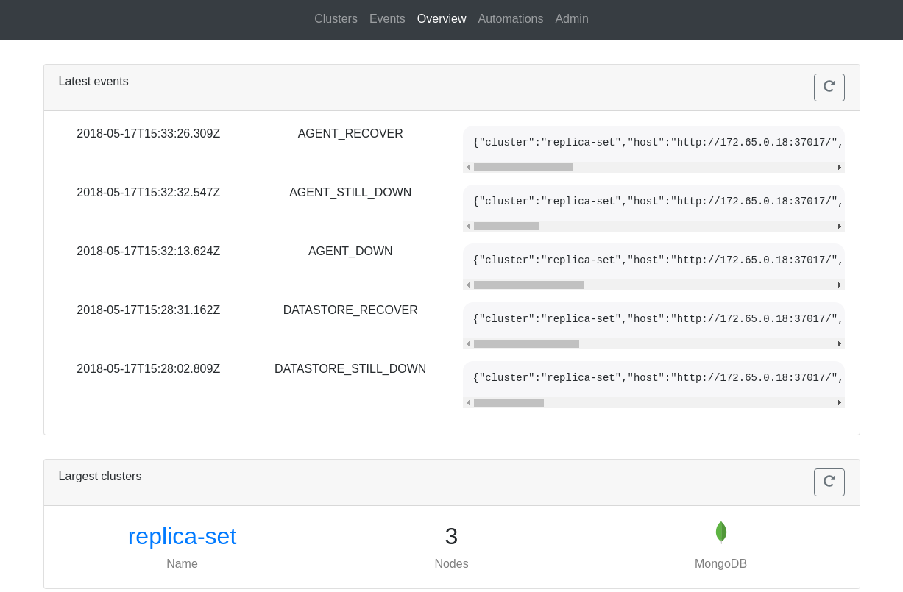

# Quick start
This guide will go through the steps needed to setup a local, docker based, playground
to test out replicante core and the official agents.
By the end you should have a full system running that can be used to experiment with and
demo all replicante features and behaviours.

**Please note**: this guide does not explain how to install and configure replicante
for production use and it does not attempt to cover all possible configuration options
and installation and management details.

**Simplified networking**: to keep commands and configurations simple subnets are
statically configured with agent containers having static IPs.


### 1. Getting the code

The playground is a [git repo](https://github.com/replicante-io/playgrounds) containing
a set of [docker-compose](https://docs.docker.com/compose/) projects.

Each docker-compose project runs a full cluster and its agents.
There is also a docker-compose project to run replicante core with all its dependencies.

Details about each project can be found in the `README.md` file of the project but generally:

  * All projects are self-bootstrapping: just `docker-compose up` and a configuration script will run too.
  * Each project has an additional `docker-compose-agents.yaml` file to run the agents too.
  * After images are pulled/built there is no more need for internet access.


```bash
$ git clone --recoursive https://github.com/replicante-io/playgrounds.git
$ cd playgrounds
```



### 2. Running a MongoDB replica set
In this example we will run a MongoDB three node replica set configuration with agents.
The same commands can be used to run any number of playgrounds so they will not be repeated.


Start the docker compose project.

The first time, this will pull and build images as needed.
Keep in mind that initialisation can take up to a minute.

The optional `-d` runs the processes in the background if you don't care for the logs.


```bash
$ cd mongo/rs
$ docker-compose -f docker-compose.yml -f docker-compose-agents.yml up [-d]
```



Make sure that the controller process exited with a zero code and all other processes are up.


```bash
$ docker-compose -f docker-compose.yml -f docker-compose-agents.yml ps
     Name                    Command               State             Ports
------------------------------------------------------------------------------------
rs_agent1_1       /replicante/agents/target/ ...   Up       0.0.0.0:37018->37017/tcp
rs_agent2_1       /replicante/agents/target/ ...   Up       0.0.0.0:37019->37017/tcp
rs_agent3_1       /replicante/agents/target/ ...   Up       0.0.0.0:37020->37017/tcp
rs_controller_1   docker-entrypoint.sh bash  ...   Exit 0
rs_node1_1        docker-entrypoint.sh mongo ...   Up       27017/tcp
rs_node2_1        docker-entrypoint.sh mongo ...   Up       27017/tcp
rs_node3_1        docker-entrypoint.sh mongo ...   Up       27017/tcp
```


### 3. Start replicante core and the WebUI

Just like other projects, a initialisation script is run to initialise and configure datastores
if needed.
It could take a couple of minutes to initialise everything the first time.

The configuration defaults to discovering all nodes for the clusters available in the playground
and runs the API and WebUI on port 16016 and 3000 respectively.


```bash
$ docker-compose up
```



Once everything is up and running the WebUI will be available at http://localhost:3000/:




### 4. Experimenting with the playground
TODO


### 5. Clean up
TODO
