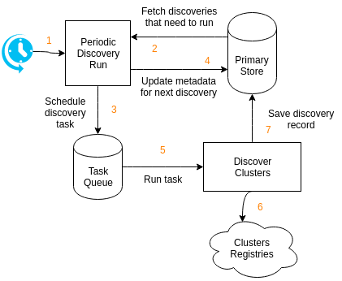
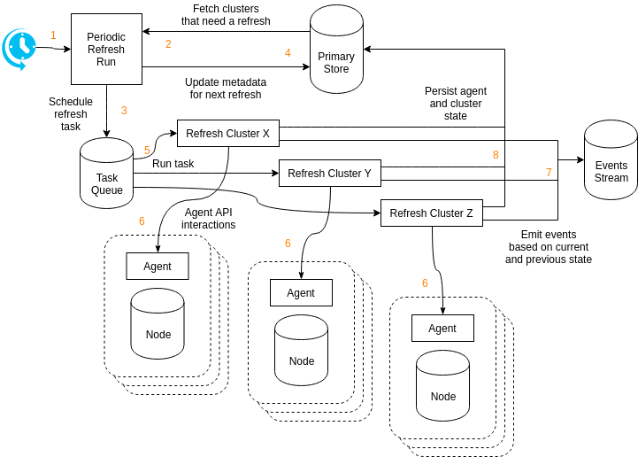

<blockquote class="warning">

This page describes how cluster discovery and refresh **will** work.

At this stage, documenting the desired solution is essential for the project to
gradually and incrementally reach this design without having to stop and rethink
or re-adapt everything every few months.

</blockquote>

At the essence of Replicante Core is a reactive engine: when a state change is
detected actions are taken to return the system to a desired state.

The idea of automation built on a reactive engine is not new:

  * It is an easy model to understand for humans (physics is based on the action-reaction paradigm).
  * It is easy enough to implement (at least compared to other options).
  * It allows us to focus on the triggers of an event and the consequences of an action without
    having to look at the entire history of the full system.

Additionally traking state changes can tell us what is happening to our system
and what we need to change as well as what our actions on the system lead to.

## Refresh and discovery
The cluster state refresh process continuously evaluates the state of clusters
so decisions can be taken, progress tracked and (re)actions taken.

The cluster discovery process aims to keep administration and management overheads at a minimum
and take advantage of the highly dynamic platforms and tools available today ("the cloud").

So how do cluster discovery and refresh work?

### Discovery

  1. The cluster `discovery` component periodically runs at fixed intervals.
     The interval should be short as it determines the delay between
     discoveries needing to run and them being scheduled.
  2. The `discovery` run looks for any discoveries with an **expected** next schedule time in the past.
     If no cluster discovery needs to run the `discovery` run does nothing.
  3. The `discovery` run schedules a discovery tasks for each discovery that needs to be performed.
  4. The **expected** next schedule time is updated to `now() + discovery interval`.
  5. A task worker picks up the discovery task.
  6. The discovery task fetches discovery records from the configured discoveries.
  7. Discovery records are updated in the DB.

### Refresh

  1. The cluster `refresh` component periodically runs at fixed intervals.
     The interval should be short as it determines the delay between cluster
     needing to refresh and the refresh being scheduled.
  2. The `refresh` run looks for any cluster with an **expected** next refresh time in the past.
     If no cluster needs to be refreshed the `refresh` run does nothing.
  3. The `refresh` run schedules a refresh tasks for each cluster that needs to run.
  4. The **expected** next refresh time is updated to `now() + refresh interval`.
  5. A task worker picks up the refresh task.
  6. The refresh task invoke the Agent API to refresh the agent state.
  7. Events are emitted for state changes.
  8. Persist agent state and aggregated cluster state to the primary store.

#### Avoid concurrent refresh tasks
Because events are generated from differences in observed states, refreshing the state of
a node from multiple processes at once may lead to duplicate and/or missing events as well
as confused and inconsistent aggregations.

Distributed locks are used to ensure a cluster is refreshed by only one process at a time.
Any cluster refresh operation attempted while another operation is already running will be discarded.

## Deleting clusters and nodes
When clusters and nodes are automatically discovered they can also automatically go away.

<blockquote class="warnig">

This feature is not currently available and is yet to be designed.

</blockquote>

## A cluster view
The newly fetched agents information is aggregated to generate an
[approximate cluster view](archnotes-cluster-view.md).
This cluster view is compared to the last known view to generate events describing changes
in the views of the system.

Because the cluster view is approximate (see [here](archnotes-cluster-view.md)) node events
are always based on reporting from the node themselves (we do not report a node as down if we
see it up, even if another node in the cluster think it is down).

Only cluster level events are generated off the top of this views.
Actions will have to check if the state of the system matches the expectations before they are applied.

## Why discover clusters?
The primary use case for Replicante is part of an automated, distributed, dynamic infrastructure that
scales from a small number of small cluster to a large number of large clusters.

It is assumed that managing a list of nodes is at best impractical, but may even be impossible
in combination with tools such as auto scaling groups and automated instance provisioners.

The idea of cluster discovery was inspired by [Prometheus](https://prometheus.io/).
Cluster discovery has several advantages:

  * A single source of truth as to which instances should exist in which clusters.
  * Automatic detection of node creation and retirement.
  * Much easier detection of agent issues (it is more difficult to tell why a push client is not pushing).
  * Agents are "checked" against some form of server inventory (server must impersonate agents to
    be polled, they can't just add themselves to the cluster and do whatever).

## Why Kafka?
[Kafka](https://kafka.apache.org/) itself isn't really the point,
the point is introspection and its implications on the ability to debug the system.

Kafka has the property that it keeps messages in its system for a configurable retention period
even if the message was consumed.
This feature is a requirement for the events stream but even without that,
having access to the full history of messages can be helpful to understand
what is happening in the system and why.

In a distributed system, where complexity runs high by nature,
any access to system introspection becomes an extremely valuable thing.

Additional distributed queueing systems may be supported in the future but those that have
this extra introspection property will be favoured (at the time of writing this means
[NATS streaming](https://nats-io.github.io/docs/nats_streaming/intro.html)).
