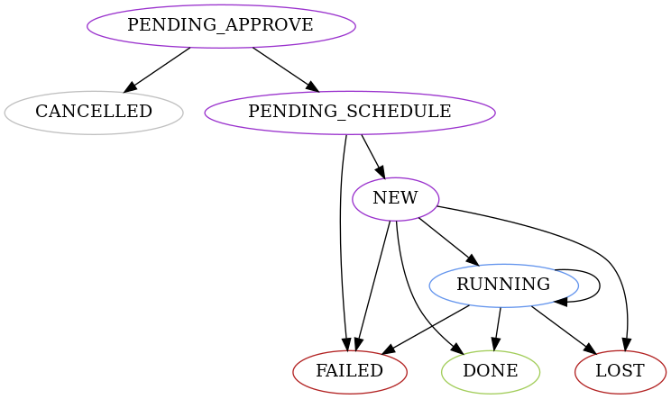

<blockquote class="warning">

**Playbooks are not a thing yet**

They will provide a way to automatically schedule actions to perform orchestrated
higher-lever operations across an entire cluster.
Writing about the actions system assuming playbook are already here makes
the entire system (agents and core) easier to think about and design.

Aspects related to Playbooks and how they work are likely to change significantly.

</blockquote>

Each agent can run a single action at any time and has a queue of actions waiting to be executed.
These actions can be scheduled either directly though the agent API or through Replicante Core.
Replicante Core can schedule actions on behalf of a user or automatically as part of a playbook.

Generally, an agent's actions queue should be short.
Replicante Core will not generate playbook actions until the playbook reaches the stage
where the actions are needed and manually scheduled actions are expected to be few.

## Action States

### State colour legend

  * Black: intermediate Core state.
  * Blue: intermediate Agent state.
  * Green: successful outcome state.
  * Gray: action not execute final state.
  * Red: unsuccessful outcome state.
  * Violet: starting state.

### States descriptions

#### `CANCELLED`
The action was interrupted or never executed.

#### `DONE`
The action finished successfully.

#### `FAILED`
Unable to successfully execute the action.

#### `LOST`
Agent records of an action were purged before Core synced them.

#### `NEW`
The Replicante Agent knows about the action and will execute it when possible.

#### `PENDING_APPROVE`
Replicante Core knows about the action but can't schedule it until it is approved.
These actions can be approved through the API so they can be scheduled.

#### `PENDING_SCHEDULE`
Replicante Core knows about the action and may or may not have sent it to the Agent.

#### `RUNNING`
The action is running on the Replicante Agent.

## Actions and playbook progression
Actions progress when the agent reports that their state has changed.
Actions progress from an initial state (like `NEW`) to a finished state like (`DONE` or `FAILED`).

Playbooks progress when all actions in the current stage have finished.
Playbooks progress in a similar way to actions, moving along stages.

Both actions and playbooks progress checks are reactive: events have to trigger them.
This is opposed to proactive checks where the system would have to poll pending and running
actions and playbooks and check if they can progress.

Reactive checks are more efficient because resources are not spent checking
over and over for states that have not changed.
Reactive checks also make Replicante Core far simpler to implement.

Events that cause actions and playbook progression are emitted by the cluster state
refresh tasks when agent actions change state or when pending actions exist.
To ensure users have an escape hatch in case the system fails to auto-detect
progress the API will allow the refresh the cluster task to `nudge` actions and playbooks.

## Actions sync
To minimise the complecity around actions concurrency Replicante Core pushes and pulls
actions to and from Agents only during a cluster refresh.

This may cause actions to stay in `PENDING_SCHEDULE` for a while as a sync needs to push
them down and one after that needs to confirm they where indeed pushed to the agent.
This delay on the other hand pays for semplicity, especially when scheduling needs to be retired.

As a result, the process of scheduling action in Replicante Core works as follows:

  1. An action is recorded in Replicante Core with a `PENDING_*` state.
  2. The action is left untouched until it reaches the `PENDING_SCHEDULE` state.
  3. During a cluster refresh operation, for each agent:
     1. Core fetches actions updates from the agent.
     2. Any `PENDING_SCHEDULE` action in Core is scheduled on the agent.
     3. Errors are captured for debugging but ignored to prevent the refresh of other nodes.

Retries are automatically performed at the next cluster refresh.

### Conflicting actions
Actions can be scheduled directly with Agents setting an action ID for them.
This is required so that Replicante Core can generate IDs for Actions without
having to interact with any Agent.

This opens the system to the situation where Replicante Core and an Agent
may have different actions with the same ID.

If this ever happens the Agent wins and Replicante Core will overwrite its Action
record with the data received from the Agent during the next cluster refresh.
