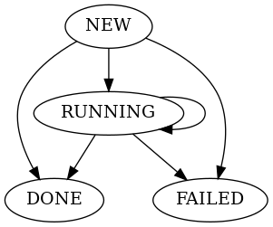

<blockquote class="warning">

**Alpha state disclaimer**

The protocol defined below is in early development cycle
and is subject to (potentially breaking) change.

</blockquote>

The Agents interface is a JSON encoded HTTP API.  
The API is versioned so that breaking changes can be rolled out gradually
with version compatibility "windows".

## Information and Monitoring
One of the tasks an agent is expected to do is provide specialised information and monitoring data.
Replicante Core will collect and aggregate this data to estimate (distributed systems, remember?)
the state and health of the cluster.

<blockquote class="info">

**A note about monitoring**

Just because "monitoring" was mentioned as one of the agent's responsibilities
it does not mean the agent is responsible for general purpose moniotring.

Use [Prometheus](https://prometheus.io/) or other tools for general purpose monitoring.

Replicante Agents MAY be built to also provide general purpose monitoring services
but that is outside the scope of this specification.

</blockquote>

### Agent information API

  
GET

  
/api/unstable/info/agent

  
Returns information about the agent itself

  
GET

  
/api/unstable/info/datastore

  
Returns information about the datastore

[Details about these endpoints](agent-info.md)

### Shards information API

  
GET

  
/api/unstable/shards

  
Returns detailed information about shards

[Details about these endpoints](agent-shards.md)

## Actions
Another task the agent is responsible for is the execution of actions.
Actions are the execution layer on which any automation is built.

Actions have the following set of properties:

  * `args`: JSON encoded arguments passed to the action.
  * `created_ts`: Timestamp the action was created on the agent.
  * `finished_ts`: Timestamp the action was considered finished (`null` if the action is not finished).
  * `headers`: Custom headers passed to the agent when the request was made.
  * `id`: Unique action request ID.
  * `kind`: Identifier of the action to execute.
            Consult the agent documentation for information about actions discovery.
  * `requester`: Entity that requestested the action to be performed.
  * `state`: State the action is currently in (see below).
  * `state_payload`: Optional JSON payload recorded when the action entered the current `state`.

The action `state` attribute indicates at which point of the lifecycle the action is:

The states are as follows:

  * `NEW`: all actions start of in the `NEW` state when they are scheduled.
  * `RUNNING`: when a `NEW` action is picked up for execution and started, it enters the `RUNNING` state.
               `RUNNING` actions can transition from `RUNNING` to `RUNNING`, when this happen their `state_payload` may change.
  * `DONE`: the agent completed execution of the action successfully.
  * `FAILED`: the action encountered an error or was otherwise unable to transition the system to the desired state.

### Actions API

  
GET

  
/api/unstable/actions/finished

  
Returns a list of finished actions

  
GET

  
/api/unstable/actions/queue

  
Returns a list of currently running or queued actions

  
GET

  
/api/unstable/actions/info/:id

  
Returns an action details as well as its state history

  
POST

  
/api/unstable/actions/schedule/:kind

  
Request the scheduling of a new action

[Details about these endpoints](agent-actions.md)
